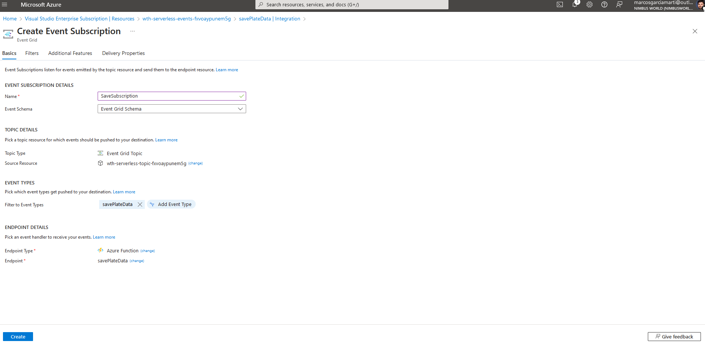
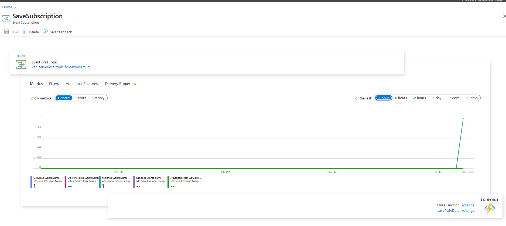

# Challenge 06 - Create Functions Using VS Code - Coach's Guide 

[< Previous Solution](./Solution-05.md) - **[Home](./README.md)** - [Next Solution >](./Solution-07.md)

## Notes & Guidance

Integration has changed in the new functions portal.  Might have to go to the old portal to add the integration.

## Step by Step Instructions

The Student Guide has step-by-step guidance for VSCode. The below instructions refer to the Azure Portal workflow, which can evolve over time and not be accurate. 

### Help references

- [Create your first function in the Azure portal](https://docs.microsoft.com/azure/azure-functions/functions-create-first-azure-function)
- [Store unstructured data using Azure Functions and Azure Cosmos DB](https://docs.microsoft.com/azure/azure-functions/functions-integrate-store-unstructured-data-cosmosdb)

### Task 1: Create function to save license plate data to Azure Cosmos DB

In this task, you will create a new Node.js function triggered by Event Grid and that outputs successfully processed license plate data to Azure Cosmos DB. The Student guide uses VSCode. We document here how to do it via the Azure Portal, for educational purposes.

1.  Using a new tab or instance of your browser navigate to the Azure Management portal, <http://portal.azure.com>.

2.  Open the **`ServerlessArchitecture`** resource group, then select the Azure Function App you created whose name ends with **Events**. If you did not use this naming convention, make sure you select the Function App that you _did not_ deploy to in the previous exercise.

3.  Select **Functions** in the menu. In the **Functions** blade, select **+ New Function**.

4.  Enter **event grid** into the template search form, then select the **Azure Event Grid trigger** template.

    a. If prompted, click **Install** and wait for the extension to install.

    b. Click **Continue**

5.  In the New Function form, fill out the following properties:

    a. For name, enter **`SavePlateData`**

    b. Select **Create**.

6.  Replace the code in the new `SavePlateData` function with the one provided in the Student Guide.

7.  Select **Save**.

### Task 2: Add an Event Grid subscription to the `SavePlateData` function

In this task, you will add an Event Grid subscription to the `SavePlateData` function. This will ensure that the events sent to the Event Grid topic containing the `savePlateData` event type are routed to this function.

1.  With the `SavePlateData` function open, select **Add Event Grid subscription**.

2.  On the **Create Event Subscription** blade, specify the following configuration options:

    a. **Name**: Unique value for the App name similar to **`saveplatedatasub`** (ensure the green check mark appears).

    b. **Event Schema**: Select Event Grid Schema.

    c. For **Topic Type**, select **Event Grid Topics**.

    d. Select your **subscription** and **`ServerlessArchitecture`** resource group.

    e. For resource, select your recently created Event Grid.

    f. For Event Tyeps, click **Add Event Type**, then enter **`savePlateData`** into the event types field. If you specified a different name in the `SendToEventGrid` class in the TollBooth solution, use that instead.

    g. Ensure the Endpoint Type is Azure Functions and the Endpoint is your **`savePlateData`**

3.  Leave the remaining fields at their default values and select **Create**.

**NOTE** We filter this subscription to only receive the event types specified within the `SendToEventGrid` class in the TollBooth solution. This will ensure that all other event types are ignored by your functions.

### Task 3: Add an Azure Cosmos DB output to the `SavePlateData` function

In this task, you will add an Azure Cosmos DB output binding to the `SavePlateData` function, enabling it to save its data to the Processed collection.

1.  Expand the **`SavePlateData`** function in the menu, then select **Integrate**.

2.  Under Outputs, select **+ New Output**, select **Azure Cosmos DB** from the list of outputs, then select **Select**.

3.  In the Azure Cosmos DB output form, select **new** next to the Azure Cosmos DB account connection field.

    > **Note**: If you see a notice for "Extensions not installed", click **Install**.

4.  Select your Cosmos DB account from the list that appears.

5.  Specify the following configuration options in the Azure Cosmos DB output form:

    a. For database name, type **`LicensePlates`**.

    b. For the collection name, type **Processed**.

6.  Select **Save**.

    > **Note**: you should wait for the template dependency to install if you were prompted earlier.

### Task 4: Create function to save manual verification info to Azure Cosmos DB

In this task, you will create a new function triggered by Event Grid and outputs information about photos that need to be manually verified to Azure Cosmos DB.

1.  Select **Functions** in the menu. In the **Functions** blade, select **+ New Function**.

2.  Enter **event grid** into the template search form, then select the **Azure Event Grid trigger** template.

    a. If prompted, click **Install** and wait for the extension to install.

    b. Click **Continue**.

3.  In the **New Function** form, fill out the following properties:

    a. For name, type **`QueuePlateForManualCheckup`**.

4.  Select **Create**.

5.  Replace the code in the new `QueuePlateForManualCheckup` function with the one provided in the Student Guide.

6.  Select **Save**.

### Task 5: Add an Event Grid subscription to the `QueuePlateForManualCheckup` function

In this task, you will add an Event Grid subscription to the `QueuePlateForManualCheckup` function. This will ensure that the events sent to the Event Grid topic containing the `queuePlateForManualCheckup` event type are routed to this function.

1.  With the `QueuePlateForManualCheckup` function open, select **Add Event Grid subscription**.

2.  On the **Create Event Subscription** blade, specify the following configuration options:

    a. **Name**: Unique value for the App name similar to **`queueplateFormanualcheckupsub`** (ensure the green check mark appears).

    b. **Event Schema**: Select Event Grid Schema.

    c. For **Topic Type**, select **Event Grid Topics**.

    d. Select your **subscription** and **`ServerlessArchitecture`** resource group.

    e. For resource, select your recently created Event Grid.

    f. For Event Tyeps, click **Add Event Type**, then enter **`QueuePlateForManualCheckup`** into the event types field. If you specified a different name in the `SendToEventGrid` class in the TollBooth solution, use that instead.

    g. Ensure the Endpoint Type is Azure Functions and the Endpoint is your **`savePlateData`**

3.  Leave the remaining fields at their default values and select **Create**.

### Task 6: Add an Azure Cosmos DB output to the `QueuePlateForManualCheckup` function

In this task, you will add an Azure Cosmos DB output binding to the `QueuePlateForManualCheckup` function, enabling it to save its data to the `NeedsManualReview` collection.

1.  Expand the `QueuePlateForManualCheckup` function in the menu, the select **Integrate**.

2.  Under Outputs, select **+ New Output** then select **Azure Cosmos DB** from the list of outputs, then select **Select**.

3.  Specify the following configuration options in the Azure Cosmos DB output form:

    > **Note**: If you see a notice for "Extensions not installed", click **Install**.

    a. For database name, enter **`LicensePlates`**.

    b. For collection name, enter **`NeedsManualReview`**.

    c. Select the **Azure Cosmos DB account connection** you created earlier.

4.  Select **Save**.

# Result
This is what the Event Subscription looks like when properly configured with the savePlateData function endpoint and the custom filter 

